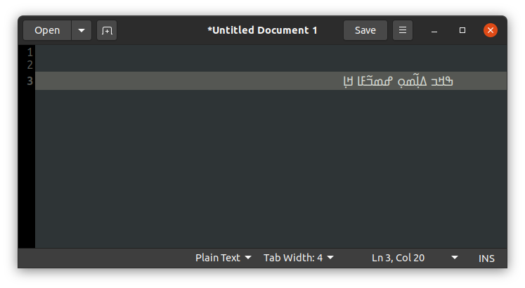
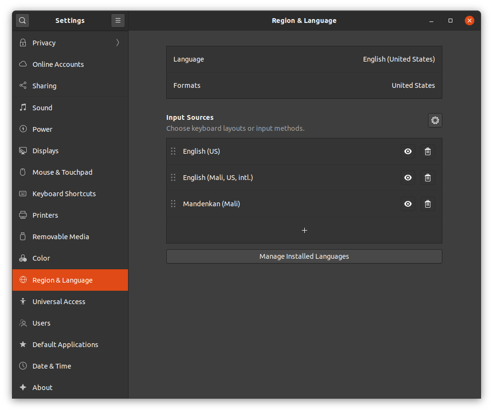
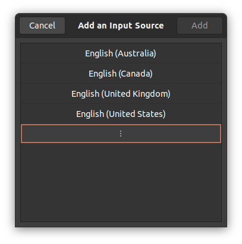
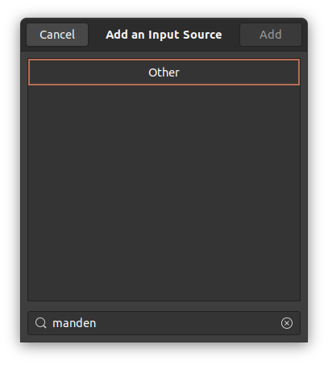
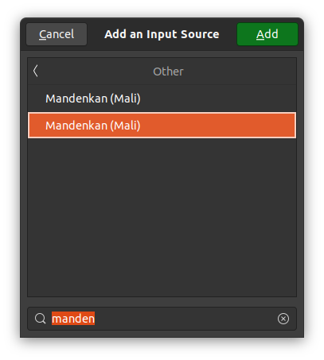
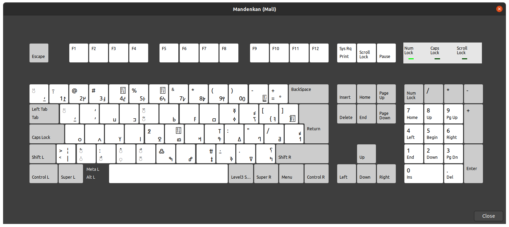

# Install and Configure NKO Keyboard on Ubuntu

This program install and configure a new keyboard layout for NKO.

It also install fonts for system.



### Prerequisites

- This script has been tested on **Ubuntu 18.04 and 20.04**.
- `git` should be installed.
- Have a `sudo` right on the computer.


### Installation 

```bash
    git clone https://github.com/munjata/nqo-keyboard.git 
    cd nqo-keyboard
    ./install-nko.sh
```

**It might require logout and login into your session.**


### Configuration

- Go to _**Setting -> Region & Language**_ and Select the _**+**_ to add a new keyboard
    

---

- Scroll down to Select has shown 
    

---

- In other search for **manden** and Select **Other**
    

---

- Select the **Second in the results**
    

---

### Testing
**Mandenka (Mali) nqo** will be added to your keyboard list.


